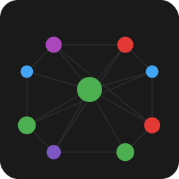
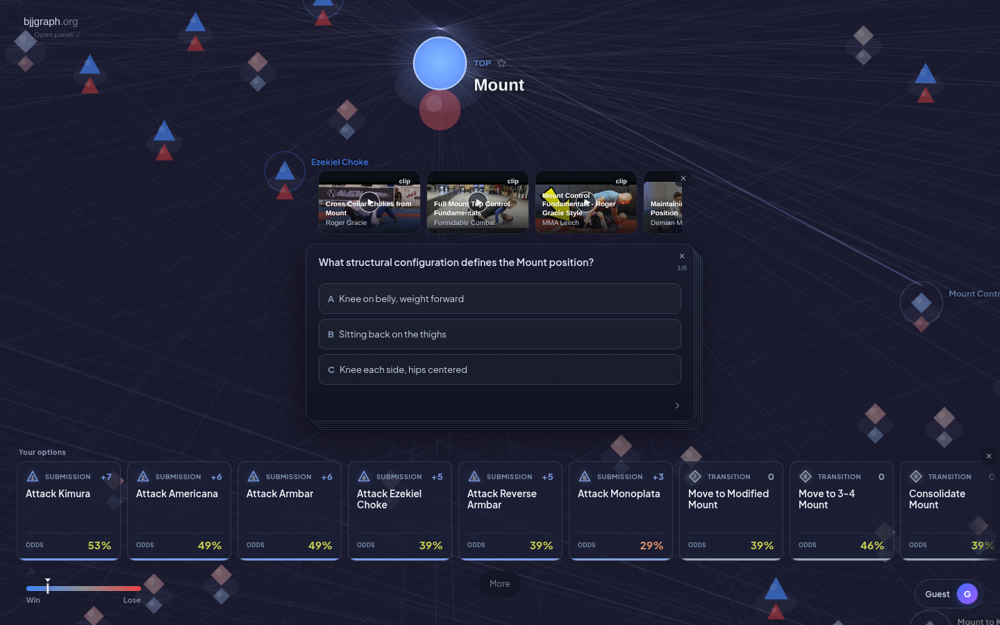

<h1 align="center"> BJJGraph</h1>

<p align="center">
  Brazilian jiu-jitsu as a playable state machine, where positions, transitions and submission attempts are all states.
</p>

<p align="center">
  <a href="https://dev.bjjgraph.pages.dev"><b>Try the dev preview</b></a> ·
  <a href="https://bjjgraph.org">Published site</a> ·
  <a href="#the-data">Get the data</a> ·
  <a href="CONTRIBUTING.md">Contribute</a><br>
  Free to use in your browser. No account required. Source-available, noncommercial licence.
</p>

<!-- SCREENSHOT SOURCE: https://dev.bjjgraph.pages.dev/Positions/Mount/Top; captured 2026-09-14 at 1440x900. The app normalizes this URL to /Positions/Mount. -->
<p align="center">
  <a href="https://dev.bjjgraph.pages.dev/Positions/Mount/Top"></a><br>
  <sub>Dev preview: Mount from the top. This README describes the dev branch; the published site can differ.</sub>
</p>

| Explore | Drill | Roll |
|---|---|---|
| Follow connected states and study both players' roles. | Review flashcards with spaced repetition and film-study clips. | Choose an attack, pass, escape or continuation and play out its possible outcomes. |

## A state is not always a position

A roll never leaves the state machine. It changes **which kind of state** the players are in.

| State | What it represents |
|---|---|
| **Position** | A relatively stable configuration, such as mount or closed guard. Players can still move, apply pressure and fight for control. Stable does not mean motionless. |
| **Transition** | A transient state: players are moving, applying forces and actively trying to change the configuration. A pass, sweep or escape is a state in the model, not just an arrow between positions. |
| **Submission** | A transient attacking state, like a transition, with the possibility of ending the game. An established attack can be finished, defended or changed into something else. Entering it is not the same as getting a tap. |

**The arrows connect states.** Attempt weights describe which techniques are attempted from a position and role. Outcome probabilities describe where an attempt can lead: success, failure or a counter. A submission finish can reach `game-over`; an unsuccessful attempt continues the exchange.

Positions have **Top / Bottom** perspectives. Transitions and submissions have **Attacker / Defender** perspectives. The role is part of the state, not a label for who is winning. Reference hubs group those perspectives for reading; they are not extra playable states.

The app interprets this model rather than stopping on every intermediate node. On dev, submission attacks have their own choices, including a separate **Finish** action. The [architecture reference](docs/Architecture.md) separates the authored graph from its display and runtime behavior.

## Study it, then try a decision

- **Explore from either side.** Open a state, read its explanation, watch a teaching clip, or follow a connected technique. Principles and systems highlight related material without starting a roll.
- **Drill what you want to retain.** Flashcards and per-deck mastery track recall. These are study measures, not a Brazilian jiu-jitsu rank.
- **Roll through the model.** Pick from the available moves and see where the exchange goes. The question has a timer; choosing a move does not. The simulation is not a prediction of your next sparring round.
- **Share a class or game plan.** Collect techniques into a list and send a partner one link.

Progress stays in your browser. Sign in only if you want cross-device sync.

## The data

<!-- COUNTS: derived from this dev-based tree at PR time (2026-09-14). Recompute with the commands in "Reproduce the numbers"; do not copy counts from the published site. -->
| Authored JSON files | Count |
|---|---:|
| Positions | **133** |
| Transitions | **1,025** |
| Submissions | **353** |

These are source-file counts, not the number of playable orbs. Submission files include **63 family hubs**, which group occurrences rather than model executable attacks. Source probabilities are authored per ruleset, with distinct gi and no-gi values.

| Read or download | What you get |
|---|---|
| [`graph.json`](graph.json) | The full graph in this checkout: role nodes, attempt weights, outcomes, flashcards and reference material. **49,794,486 bytes** at this revision. |
| [`content/`](content/) | Authored JSON alongside generated Markdown pages. Edit the JSON, not the Markdown. |
| [Published release data](https://github.com/diogoseca/bjjgraph/releases/latest) | Downloadable `graph.json` and `graph.json.gz`. Releases follow production and may differ from dev. No API key required. |
| [`CITATION.cff`](CITATION.cff) | Citation metadata for this project. |

```sh
# Authored offers from bottom closed guard, not a runtime-filtered hand.
jq '.positions["closed-guard/bottom"].transitions[] | {technique, attemptProbabilityByRuleset, successRate}' graph.json

# One transient state's performer role, success rates and destinations.
jq '.transitions["kneebar-from-grasshopper/attacker"] | {fromRole, successRateByRuleset, outcomes}' graph.json
```

### Two findings you can recompute

- **Reachability changes with the ruleset.** The no-gi walk excludes **104 techniques and 18 position role-nodes**. Those roles belong to nine guard sites: Collar Sleeve, Inverted Lasso, Lapel, Lasso, Piranha, Ringworm, Russian Leg Lasso, Squid and Worm. The walk follows the frame's probabilities from standing; it does not match guard names.
- **Attempt weight and success rate answer different questions.** Summing the authored no-gi attempt weights across all position-role rows puts **Knee Slice Pass first** (577 points across 41 rows) and **Triangle Setup third** (368 across 22). Their emitted attacker success rates are **53.6%** and **28%**. These sums give each source row equal weight, including unreachable rows; they are not roll frequencies, match statistics or a recommendation ranking.

<details>
<summary><b>Reproduce the numbers</b></summary>

Count authored files in this checkout:

```sh
find content/Positions -name '*.json' | wc -l
find content/Transitions -name '*.json' | wc -l
find content/Submissions -name '*.json' | wc -l
```

Emit the local payload before checking availability, so the validator checks the shipped wire as well as the source graph:

```sh
python3 scripts/regenerate_neural_data.py
npm run validate:availability
```

Read `counts.nogi` and `excluded.nogi.positions` in [`tests/artifacts/ruleset_availability.json`](tests/artifacts/ruleset_availability.json). The ranking uses `positions[*].transitions[].attemptProbabilityByRuleset.nogi`, grouped by `target`, excluding null cells; success rates come from `transitions["<target>/attacker"].successRate`. Hubs carry no attempt rows. The [content standards](docs/Content.md) explain why `null` is not zero.

</details>

## What the numbers do not prove

Probabilities are **authored estimates**, checked by schema and graph validators and open to correction by pull request. Calibration and community feedback can change them. A graph that is internally consistent can still be wrong about jiu-jitsu.

State boundaries, technical descriptions, safety, ruleset assumptions and probability estimates need review by a **panel of black-belt Brazilian jiu-jitsu practitioners**. This README does not claim that validation has happened. Generated content and passing automated checks are not substitutes for it.

Use this alongside coached practice, not as permission to attempt a submission or as a measure of anyone's belt level. If a claim looks wrong, [open a correction](CONTRIBUTING.md) with the state, role, ruleset and your reasoning.

## How it is built

```text
Authored JSON → Jinja2 templates → generated Markdown → static pages
      └──────→ graph data + deferred study chunks ────→ canvas app
```

- **Content and pipeline:** [`content/`](content/), [`templates/`](templates/) and [`scripts/`](scripts/). The data, schema and build contracts are documented in [Architecture](docs/Architecture.md) and [Content](docs/Content.md).
- **App:** [`neural/`](neural/), with the main imperative canvas component in `neural/src/app.src.jsx`. It loads a compact graph, deck manifest and curriculum, then fetches study content as needed.
- **Static build:** [Quartz](https://quartz.jzhao.xyz/), the MIT project under [`source/`](source/), emits the pages and crawlable fallback beneath the app.
- **Delivery:** Cloudflare Pages and share-preview Functions in [`functions/`](functions/). Supabase provides optional account sync; PostHog provides analytics.
- **Checks:** validators in `scripts/`, node tests in [`tests/`](tests/) and Playwright journeys in [`e2e/`](e2e/).

## Contributing

A correction is more useful than a new feature built on a wrong assumption. Propose one through an issue or a PR against the authored JSON. Include the evidence or technical reasoning that changed your answer.

```sh
npm run validate:json
npm run validate:graph
npm run regenerate:build
```

The full regeneration command can invoke paid AI content enrichment and rewrites generated artifacts. Read [CONTRIBUTING.md](CONTRIBUTING.md) for prerequisites and the workflow before running it. Never edit generated `content/*.md`; keep one change per PR and stage files by explicit path. Bot PRs receive the same review as human ones.

For app work, read [CLAUDE.md](CLAUDE.md) section 6 before editing. It records the implementation traps that are not obvious from a screenshot.

## Licence and contact

**Source-available, not open source.** BJJGraph uses the [PolyForm Noncommercial 1.0.0 licence](LICENSE.md). Noncommercial use is permitted under its terms; commercial use requires separate permission. The licence text is authoritative.

For the corpus or app, [open a GitHub issue](https://github.com/diogoseca/bjjgraph/issues). For a human conversation, contact [Diogo Seca on LinkedIn](https://www.linkedin.com/in/diogoseca/).
