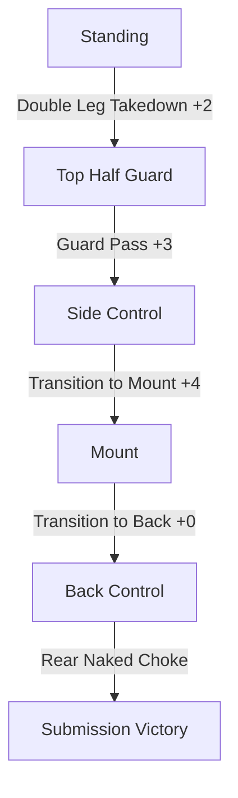
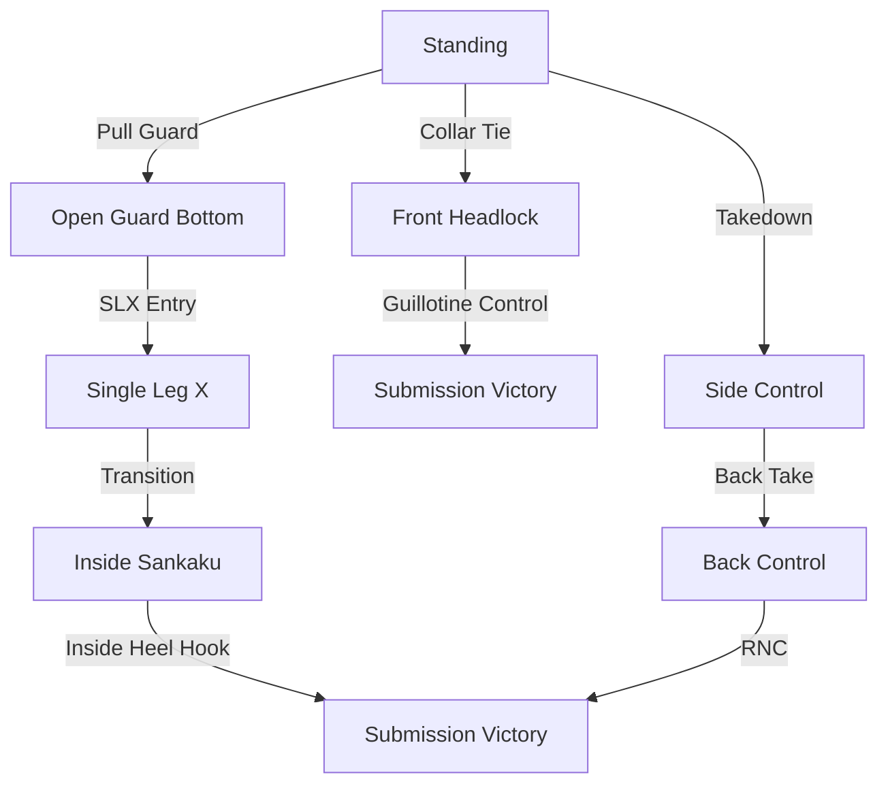

# Competition Strategy
#bjj #strategy #competition #system

This document outlines strategic approaches to competition using the BJJ State Machine system, focusing on optimizing decision-making based on rule sets, scoring systems, and time management.

## Strategic Frameworks by Competition Type

### IBJJF Points-Based Competition

For IBJJF and similar points-based competitions, your strategic approach should consider:

#### Point-Maximizing Pathways


#### Strategic Path Selection
1. **Early Match Strategy** (1st third of match)
   - Focus on takedown or sweep for initial 2 points
   - Emphasize guard passing to establish point advantage
   - Avoid low-percentage submission attempts

2. **Mid Match Strategy** (2nd third of match)
   - Transition to higher-scoring positions (mount, back control)
   - Begin attacking with high-percentage submissions only
   - Maintain positional control even if submission fails

3. **Late Match Strategy** (final third of match)
   - If ahead on points: maintain dominant position, avoid risks
   - If behind on points: pursue highest-percentage submission paths
   - Control pace through strategic positional transitions

#### Position Hierarchy (Point Value)
- Back Control (4 points) - Target position when ahead
- Mount (4 points) - Secondary target position
- Side Control (3 points via guard pass) - Transitional position
- Guard Top after Sweep (2 points) - Initial advantage position
- Top after Takedown (2 points) - Initial advantage position

### Submission-Only Competitions

For submission-only formats (ADCC, EBI, GrappleFest), adopt pathways that maximize submission probability rather than positional points:

#### Submission Probability Pathway


#### Strategic Path Selection
1. **Early Match Strategy**
   - Establish your attacking system quickly
   - Don't waste energy fighting for takedowns unless it's your primary path
   - Enter your highest-percentage submission system

2. **Mid Match Strategy**
   - Create submission chains rather than isolated attempts
   - Force defensive reactions that expose secondary submissions
   - Control pace and conserve energy

3. **Late Match Strategy**
   - If overtime rules apply, position for advantage criteria
   - Increase submission attempt frequency
   - Target sequential submission attempts to exhaust defenses

#### Submission System Hierarchy (Success Rate)
- Back Control → RNC (75% completion rate) - Highest percentage
- Inside Sankaku → Inside Heel Hook (70% completion rate)
- Mount → Arm Triangle (65% completion rate)
- Triangle Control → Triangle Finish (65% completion rate)
- Guillotine Control → Finish (60% completion rate)

## Decision Trees for Competition

### Match Opening Decision Tree
```
If opponent has superior wrestling/judo credentials:
    Execute [[Pull Guard]] → Enter your guard system
Else if you have superior takedown skills:
    Execute [[Double Leg Takedown]] or [[Single Leg Takedown]]
Else if opponent is aggressive forward mover:
    Execute [[Front Headlock Entry]] or [[Collar Drag]]
Else (neutral initial engagement):
    Execute your highest-percentage initial movement
```

### Points Match Decision Tree (When Leading)
```
If leading by 2 points or less:
    Continue advancing position for additional points
Else if leading by 3-6 points:
    Focus on control and high-percentage submissions only
Else if leading by 7+ points:
    Maximize position retention and minimize risk
    Choose safe transitions that maintain control
```

### Points Match Decision Tree (When Trailing)
```
If trailing by 2 points or less:
    Execute highest-percentage sweep or reversal
Else if trailing by 3-7 points:
    Force scrambles and transition to highest-percentage submission positions
Else if trailing by 8+ points:
    Maximum risk acceptance - pursue low-percentage but quick submissions
    Sacrifice position for submission attempts
```

## Rule-Specific Strategy Adjustments

### IBJJF/UAEJJF Rules
- Prioritize legal submission pathways based on belt level
- White/Blue belt: Focus on [[Closed Guard Bottom]] → [[Triangle Control]] pathway
- Purple and above: Incorporate [[Single Leg X]] but avoid heel hook transitions
- Maintain awareness of advantage-scoring movements for tiebreakers

### ADCC Rules
- First half: Focus on takedowns and positional control (points don't count)
- Second half: Implement point-scoring strategy if submissions haven't materialized
- Utilize full range of leg entanglements and submissions

### EBI/Combat Jiu-Jitsu Rules
- Emphasize back takes to avoid overtime scenarios
- In overtime, prioritize back control starting position
- Develop specific strategies for overtime defense and escape time

## Timing-Based Strategy

### Five-Minute Match
- Accelerate decision-making timeline
- Enter primary submission system by 1:30 mark
- Execute submission attempts by 3:00 mark
- Be willing to sacrifice position for submission after 4:00 mark if behind

### Ten-Minute Match
- Implement strategic phases:
  * 0:00-3:00: Establish dominant position
  * 3:00-6:00: Systematic submission attempts
  * 6:00-8:00: Reassess and adjust approach
  * 8:00-10:00: Finalize strategy based on match status

### Unlimited Time Match
- Focus on energy efficiency
- Implement wave-like intensity patterns
- Emphasize systematic breakdown of defenses
- Utilize position cycling to create cumulative fatigue in opponent

## Energy Management Through State Selection

Each state in the BJJ system has an associated energy cost. Strategic selection of pathways can optimize energy expenditure:

### Low-Energy Pathway
```
Standing → Pull Guard → Half Guard Bottom → Deep Half Guard → Sweep → 
Side Control → Technical Mount → Back Control → Submission
```

### Explosive Energy-Intensive Pathway
```
Standing → Double Leg → Side Control → Mount → Submission
```

## Opponent-Specific Strategies

### Against Stronger/Athletic Opponents
- Utilize [[Open Guard Bottom]] → [[Single Leg X Guard]] → [[Ashi Garami]] pathway
- Prioritize mechanical control positions over those requiring strength
- Emphasize submission setups that use leverage rather than power

### Against Technical Guard Players
- Use [[Standing up|Standing Position]] → [[Double Leg Takedown]] → passing sequence
- Maintain heavy pressure in Side Control and Mount transitions
- Avoid entering complex guard configurations

### Against Aggressive Passers
- Employ [[Half Guard Bottom]] → [[Deep Half Guard]] → [[Sweep Sequence]]
- Use [[Knee Shield Half Guard]] as a buffer position
- Capitalize on over-commitment with [[Counter Attacks]]

## Competition Mindset Framework

1. **Pre-Match Visualization**: Mentally rehearse your primary and backup pathways
2. **Opening Phase Commitment**: Fully commit to your chosen opening without hesitation
3. **Mid-Match Assessment**: Quick position/advantage evaluation at regular intervals
4. **Adaptive Sequencing**: Adjust pathways based on opponent reactions
5. **Terminal Focus**: As submission opportunities arise, narrow focus to technical execution

By integrating strategic planning with the BJJ State Machine system, you can approach competitions with a structured decision-making framework that optimizes your chances of success across different rule sets and match scenarios.
